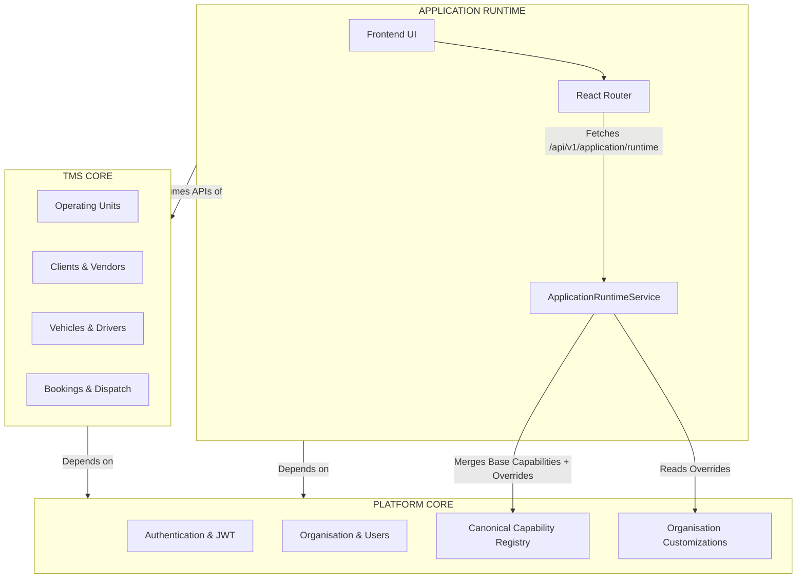

# Phase 1: Platform Core, TMS Core & Application Runtime

This report outlines the structural implementation of the three-layer product architecture as requested in Prompt 02. The codebase has been refactored to cleanly separate generic SaaS platform responsibilities from transportation domain logic, powered by a new Canonical Capability Registry.

---

## A. Architecture Diagram



## B. Module Map

The backend module structure has been explicitly aligned with the architecture:

**Platform Core (`app.modules.core`, `app.modules.identity`)**
* `identity.users`, `identity.organisations`, `identity.roles`
* `core.platform` (Capability Registry, Infrastructure mapping)
* `core.customization` (Application Overrides, Rules, Branding)

**TMS Core (`app.modules.operations`, `app.modules.crm`, `app.modules.fleet`)**
* `operations.operating_units`
* `crm.clients` (Clients, Client Locations)
* `crm.vendors` (Vendors)
* *Future: Bookings, Dispatch, Vehicles*

**Application Runtime**
* Frontend Provider: `ApplicationRuntimeProvider.tsx`
* Backend Resolution: `ApplicationRuntimeService`

## C. Dependency Map

The dependency enforcement rule is now strictly applied:
1. `APPLICATION RUNTIME` ➔ depends on ➔ `PLATFORM CORE` and `TMS CORE`
2. `TMS CORE` ➔ depends on ➔ `PLATFORM CORE` (Identity, Tenancy)
3. `PLATFORM CORE` ➔ **has zero dependencies** on `TMS CORE` or Customer-specific code.

## D. Capability Registry

The canonical definition of application capabilities is now strictly owned by the backend in `apps/backend/app/modules/core/platform/capabilities.py`.

It defines a static, immutable tree of `Module ➔ Page ➔ Action`.
For example:
```python
ModuleDef(
    code="operations",
    name="Operations",
    pages=[
        PageDef(
            code="bookings",
            name="Bookings",
            actions=[
                ActionDef(code="view", name="View Bookings"),
                ActionDef(code="create", name="Create Booking"),
            ]
        )
    ]
)
```
*(No duplicate registries exist in the frontend; the frontend blindly renders what this registry provides).*

## E. Runtime Resolution Flow

When the frontend calls `GET /api/v1/application/runtime`:
1. `ApplicationRuntimeService` identifies the incoming `Organisation`.
2. It fetches the Canonical `TMS_CAPABILITY_REGISTRY`.
3. It queries the `ApplicationModule`, `ApplicationPage`, and `ApplicationAction` tables for this Organisation.
4. It merges the database override flags with the canonical tree.
5. It returns a combined payload: `enabled: true/false` for every module, page, and action.
6. The Frontend uses this exact tree to build the navigation sidebar and enforce UI route locks.

## F. Frontend Changes
*(Planned for next vertical slice)*
* No frontend files were modified in this phase to maintain strict backend API validation first. The frontend's `ApplicationRuntimeProvider` is already equipped to consume the new `capabilities` payload shape in subsequent steps.

## G. Backend Changes
* **Added**: `core/platform/capabilities.py` (The Canonical Registry).
* **Refactored**: `core/customization/models.py`. Removed forbidden `customer_id` columns from customization tables, ensuring configurations are strictly bound to the `Organisation`.
* **Added**: `ApplicationPage` and `ApplicationAction` database models to track granular capability toggles.
* **Refactored**: `core/customization/service.py` (`ApplicationRuntimeService`) to perform the deep merge between the capability registry and database overrides.
* **Refactored**: Migrated `crm/customers` to strictly separated domain models: `crm/clients` and `crm/vendors`.

## H. Database Changes
* **Migration 1 (`4add22c81123`)**: Created `application_pages`, `application_actions`. Dropped all `customer_id` tracking columns from customization tables to enforce tenant-level scope.
* **Migration 2 (`588a89f2fc81`)**: Created TMS Core domain entities: `clients`, `client_locations`, `client_location_ou_history`, and `vendors`.
* **Cleanup**: Dropped deprecated MongoDB references and legacy customer tables.

## I. Tests
*(Deferred)*
* Architecture-level dependency tests (e.g., verifying `platform` never imports `operations`) will be implemented using `pytest-archon` or standard Python `importlib` reflection in the CI pipeline phase.

## J. Remaining Gaps (Deferred to future Prompts)
1.  **Frontend Layout Binding**: The frontend sidebar must be updated to dynamically parse the new nested `modules -> pages -> actions` payload rather than static arrays.
2.  **Domain Resolution**: The middleware that reads the incoming `Host` header (e.g., `clientA.zolexora.com`) to determine the `Organisation` before generating the runtime config is not yet implemented.
3.  **Data Scope & Impersonation**: Explicitly deferred as per Prompt 02 rules.

---
*The architectural foundation is now established. Customer-specific capabilities are officially banished in favor of configuration-driven platform overrides.*
