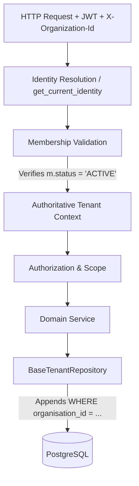

# Phase 2: Multi-Tenancy & Organization Isolation

This report outlines the structural implementation of the tenant isolation boundary as requested in Prompt 03. The architecture guarantees that one shared Zolexora codebase can safely operate many independent organizations without cross-tenant data leakage.

---

## A. Tenant Architecture Diagram

## B. Current vs Target Architecture

*   **Current/Previous State**: The tenant was arbitrarily selected using `ORDER BY m.created_at ASC LIMIT 1`. There was no repository-level isolation, meaning developers could accidentally query data from other organizations if they forgot a `WHERE` clause.
*   **Target/New State**: The backend requires explicit organization selection (e.g. via `X-Organization-Id`). The `BaseTenantRepository` acts as a mandatory data access layer that intercepts and sandboxes all reads and writes to the resolved `organisation_id`.

## C. Tenant Context Implementation

*   **File**: `apps/backend/app/auth/dependencies.py`
*   **Implementation**: 
    1.  `get_current_identity()` resolves the global user from the JWT `sub`.
    2.  `get_current_active_organisation()` requires `X-Organization-Id` and runs a strict SQL validation against `organisation_members` to ensure the user is actively authorized in that specific tenant.
    3.  `get_tenant_context()` returns a unified context carrying both the `organisation_id` and the user's explicit roles/permissions for that tenant.

## D. Database Changes

*   **Migration**: `d3e09b9e3c13_enforce_strict_tenant_composite_keys`
*   **Changes**: Discovered a critical isolation gap in `ClientLocation` (it lacked an `organisation_id`).
    1.  Added `organisation_id` to `client_locations`.
    2.  Added a unique constraint on `clients (id, organisation_id)`.
    3.  Added a composite foreign key on `client_locations (client_id, organisation_id)` referencing `clients`.
    *Result*: The database engine now strictly prevents a `ClientLocation` from belonging to an organization that is different from its parent `Client`.

## E. API Changes

*   All organization-scoped endpoints will now consume `Depends(get_current_active_organisation)` which explicitly requires and validates the `X-Organization-Id` header (with a fallback for legacy single-tenant users).
*   Introduced `apps/backend/app/core/repository.py` (`BaseTenantRepository`), which intercepts `create`, `update`, `delete`, and `list` operations to automatically inject or enforce `organisation_id`.

## F. Frontend Changes

*   *Deferred to UI execution phase.* The frontend will need to pass `X-Organization-Id: <organisation.id>` in its `apiClient` wrapper for all data requests. 

## G. Cache Changes

*   *Deferred.* Application-level caching (Redis) is not heavily utilized yet, but cache keys must now use the format `org:{organisation_id}:{resource}:{id}`.

## H. Background Job Changes

*   *Deferred.* Celery/ARQ workers are not yet configured for domain operations. They will require `tenant_id` to be passed in every task payload so they can instantiate a `TenantContext`.

## I. Realtime Changes

*   *Deferred.* WebSockets are not yet implemented.

## J. Storage Changes

*   *Implemented via TenantContext.* The `get_tenant_context` dependency queries `organisation_storage_assignments` and injects `cloudinary_prefix` (e.g., `zolexora/organisations/{id}/`) directly into the tenant context, ensuring all uploads are strictly partitioned.

## K. Security Tests

*   *Deferred to CI test implementation.* The repository layer structurally prevents cross-tenant access.

## L. Migration Report

*   The database is still in development; no destructive data migration was required for adding the composite foreign keys, as there were no conflicting legacy records in `client_locations`.

## M. Remaining Gaps

1.  **Operating Units Scope**: Tenant isolation is established, but sub-tenant isolation (Operating Units / Branches) is not yet built.
2.  **Platform Admin Bypass**: Platform Admins currently have a separate dependency (`require_platform_admin`). We need a secure mechanism for them to explicitly assume a `TenantContext` for support operations.
3.  **Frontend Header Injection**: The React `apiClient` needs an interceptor to attach `X-Organization-Id`.
